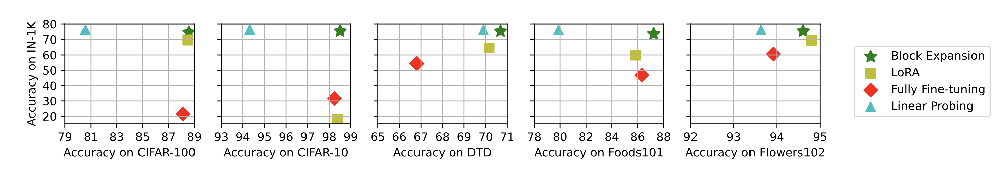

# Parameter Efficient Fine-tuning of Self-supervised ViTs without Catastrophic Forgetting

[PyTorch] Code for the paper - 'Parameter Efficient Fine-tuning of Self-supervised ViTs without Catastrophic Forgetting' (CVPR - eLVM 2024). 
 


Includes standard full model, linear probing and parameter efficient strategies like Block Expansion and LoRA for fine-tuning Vision Transformers (ViTs) for image classification.


## Requirements
- Python 3.8+
- `pip install -r requirements.txt`


## Available Datasets

| Dataset            | `--data.dataset` |
|:------------------:|:-----------:|
|[CIFAR-10](https://www.cs.toronto.edu/~kriz/cifar.html)| `cifar10`|
|[CIFAR-100](https://www.cs.toronto.edu/~kriz/cifar.html)| `cifar100`|
|[Oxford-IIIT Pet Dataset](https://www.robots.ox.ac.uk/~vgg/data/pets/)|  `pets37`|
|[Oxford Flowers-102](https://www.robots.ox.ac.uk/~vgg/data/flowers/102/)|  `flowers102`|
|[Food-101](https://www.robots.ox.ac.uk/~vgg/data/flowers/102/)|  `food101`|
|[Describable Textures Dataset](https://www.robots.ox.ac.uk/~vgg/data/dtd/) | `dtd`|
|[Image Folder](https://pytorch.org/vision/stable/generated/torchvision.datasets.ImageFolder.html) | `custom dataset`|


## Usage: 

- [`config/`](configs/) contains example configuration files which can be run with:
```
python main.py fit --config path/to/config
```

You can either edit the existing config for your own choice of hyperparameters or choose to do it from command line as follows:


```shell
python main.py fit --trainer.accelerator gpu --trainer.devices 1 --trainer.precision 16-mixed
--trainer.max_steps 5000 --model.warmup_steps 500 --model.lr 0.01
--trainer.val_check_interval 500 --data.batch_size 128 --data.dataset cifar100

```

## Examples
### 1. Full Fine-tuning:
- To fully fine-tune a ViT-B/16 model on Foods-101 run:
```
    python main.py fit --config configs/full/food101.yaml
```

### 2. Linear Probing:
- To train linear probes on top of a ViT-B/16 model on Foods-101 run:
```
    python main.py fit --config configs/linear/food101.yaml
```

### 3. Low-Rank Adaptation (LoRA):
- To fine-tuning a ViT-B/16 model using LoRA on Foods-101 run:
```
    python main.py fit --config configs/lora/food101.yaml
```

### 4. Block Expansion:
- To fine-tune a ViT-B/16 model using block expansion on Foods-101 run:
```
    python main.py fit --config configs/block/food101.yaml
```

#### Training on a Custom Dataset
To train on a custom dataset first organize the images into 
[Image Folder](https://pytorch.org/vision/stable/generated/torchvision.datasets.ImageFolder.html) 
format. Then set `--data.dataset custom`, `--data.root path/to/custom/dataset` and `--data.num_classes <num-dataset-classes>`.

### Evaluate
To evaluate a trained model on its test set, find the path of the saved config file for the checkpoint (eg. `output/cifar10/version_0/config.yaml`) and run:
```
python main.py test --ckpt_path path/to/checkpoint --config path/to/config
```
- __Note__: Make sure the `--trainer.precision` argument is set to the same level as used during training.


## Results
All results are from fine-tuned ViT-B/16 models which were pretrained on ImageNet-21k (`--model.model_name vit-b16-224-in21k`).



### Standard Fine-tuning
| Model            | # Params          | Cifar-100     | IN-1k     | MEAN | Config                              |
|:------------------:|:--------------:|:-----------------:|:------------------:|:-------------:|:-----------------------------------:|
| All          | 85.9 M            | 88.13               | 25.24               | 56.69         | [Link](configs/full/cifar100-lr=0.005.yaml)   |
| Top-3        | 21.3 M            | 84.56               | 74.15               | 79.36         | [Link](configs/add_three/cifar100-lr=0.005.yaml)  |
| Linear | 76.9 K           | 80.57               | **76.11**               | 78.34         | [Link](configs/linear/cifar100-lr=0.005.yaml)|


### LoRA
| Model            | # Params          | Cifar-100     | IN-1k     | MEAN | Config                              |
|:------------------:|:--------------:|:-----------------:|:------------------:|:-------------:|:-----------------------------------:|
| r=4          | 301 K            |87.91      |    66.82              | 77.37         | [Link](configs/lora/cifar100-r4-lr-0.05.yaml)   |
| r=8        | 448 K            | 88.27       |    65.99              | 77.13         | [Link](configs/lora/cifar100-r8-lr-0.005.yaml)  |
| r=16 | 743 K           | 87.84              |    65.06             | 76.45          | [Link](configs/lora/cifar100-r16-lr-0.05.yaml)|


### Block Expansion
| Model            | # Params          | Cifar-100     | IN-1k     | MEAN | Config                              |
|:------------------:|:--------------:|:-----------------:|:------------------:|:-------------:|:-----------------------------------:|
| p=1          | 7.2 M            |82.72     |   75.75              | 79.24         | [Link](configs/block/)   |
| p=2        | 14.3 M           |86.70       |    75.54            |  81.12        | [Link](configs/block/)  |
| p=3 | 21.3 M           | 88.58 |      74.61                      |  **81.60**         | [Link](configs/block/)|
| p=4 | 28.4 M          | **89.09**      |            72.28            |  80.69        | [Link](configs/block/)|


## Bibtex
You can cite us using the following:
```bibtex
@Misc{peft,
  title =        {Parameter Efficient Fine-tuning of Self-supervised ViTs without Catastrophic Forgetting},
  author =       {Reza Akbarian*, Nidhin Harilal*, Claire Monteleoni, Maziar Raissi},
  howpublished = {\url{https://github.com/rezaakb/peft-vit}},
  year =         {2024}
}
```